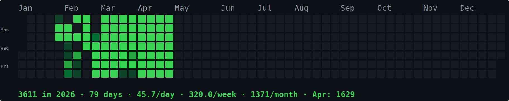

```
╔══════════════════════════════════════════════════════════════════╗
║                                                                  ║
║   ██████╗ ██╗██╗      ██████╗ ████████╗                          ║
║   ██╔══██╗██║██║     ██╔═══██╗╚══██╔══╝                          ║
║   ██████╔╝██║██║     ██║   ██║   ██║                             ║
║   ██╔═══╝ ██║██║     ██║   ██║   ██║                             ║
║   ██║     ██║███████╗╚██████╔╝   ██║                             ║
║   ╚═╝     ╚═╝╚══════╝ ╚═════╝    ╚═╝                            ║
║                                                                  ║
║   quantitative vibing                                            ║
║                                                                  ║
╚══════════════════════════════════════════════════════════════════╝
```

<div align="center">

[](https://x.com/cryptopilot16)
[](https://t.me/cryptostarship)



</div>

---

### Tech Stack

<table>
<tr>
<td align="center"><b>Languages</b></td>
<td>


</td>
</tr>
<tr>
<td align="center"><b>Frontend</b></td>
<td>


</td>
</tr>
<tr>
<td align="center"><b>Backend</b></td>
<td>

</td>
</tr>
<tr>
<td align="center"><b>Infra</b></td>
<td>


</td>
</tr>
<tr>
<td align="center"><b>Web3</b></td>
<td>


</td>
</tr>
<tr>
<td align="center"><b>AI</b></td>
<td>


</td>
</tr>
</table>

---

### Projects

| Project | Description | Stack | Lines |
|---|---|---|---|
| **pm-relay** | Real-time spread tracking and automated execution across multiple betting venues and prediction markets | `Python` `React` `Node.js` `Polygon` | ~60K |
| **Tailwinds** | Live flight data aggregation, tracking, and alerting platform with multi-source ingestion | `TypeScript` `Next.js` `Node.js` | ~21K |
| **f1_analytics** | Race telemetry processing, driver performance analysis, fantasy optimization, and strategy visualization for Formula 1 | `JavaScript` `React` | ~9K |
| **skybuddy** | Interactive 3D globe with real-time aircraft tracking using ADS-B transponder data | `JavaScript` `Cesium.js` | ~5K |
| **TradingOdds** | Execution and portfolio management layer for decentralized prediction markets | `TypeScript` | ~4K |
| **smartmoney-radar** | Wallet profiling and on-chain transaction flow monitoring with pattern detection | `TypeScript` | — |
| **clawnux** | Autonomous coding agent with multi-model orchestration and project scaffolding | `TypeScript` | — |
| **codex-control** | Server provisioning, process management, and deployment automation toolkit | `Shell` | ~200 |
